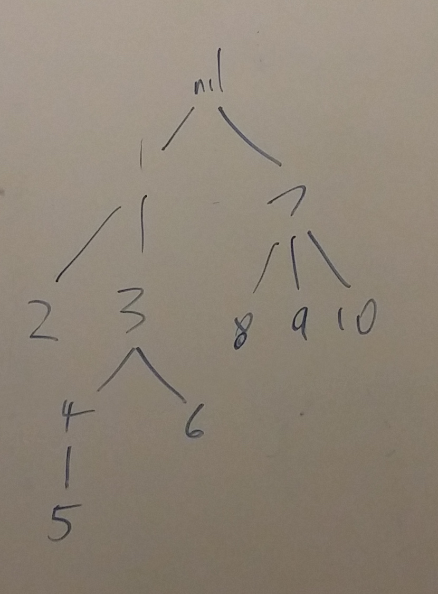

# skip-list-tree

This code implements a class `FSLNode`, which stands for Forest Skip List Node. `FSLNode` is an implementation of a set: it supports `insert` and `find` in `O(log n)` average case time. I plan to extend it to implement a dictionary.

`FSLNode` is a rose tree with the following restrictions:

- The top node has a value of `nil`, no other nodes have this value.
- Every node has a smaller value than any of its children.
- If a node has two children `c1` and `c2` and `c1` is an earlier child, then all of `c1`'s descendants have a smaller value than `c2`.

Here's what it looks like:



This tree should be approximately balanced, by which I mean that every level should have about twice as many nodes as the level above it, and every non-leaf node should have on average two children.

The search algorithm is pretty simple. It could be written like this:

```ruby
class FSLNode
  # ...

  def find_predecessor(target_value)
    return self if @value == target_value
    return nil if !is_root? && @value > target_value

    @children.reverse_each do |child|
      if child.value <= target_value
        return child.find(target_value)
      end
    end 

    nil
  end
end
```

So, line by line: if you are the target value, return yourself. If you aren't the root and your value is greater than what you're looking for, then the target is not going to be found (because all your descendants have greater values than you), so return nil. Now, look backwards through your children until you find one whose value is smaller than your target. Recursively search that child for the target.

The insert method starts out pretty similarly: once you find the right place to insert yourself, insert yourself there. But then the algorithm does something tricky: it moves the inserted node up the tree.

....

## Background

This data structure is basically equivalent to a skip list, but I think that it's more naturally expressed as a tree than as a 2D linked list, so I implemented it this way instead.